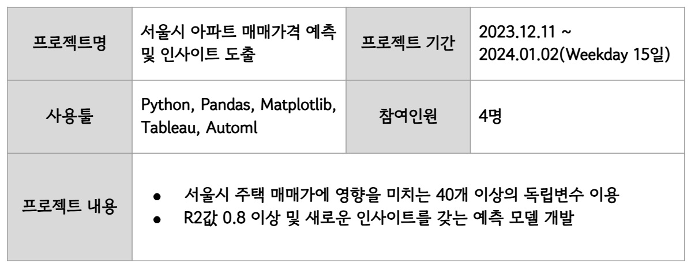
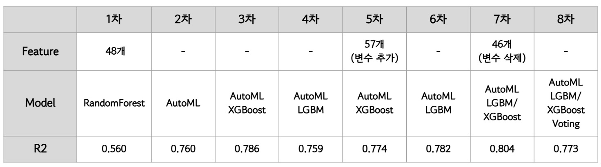
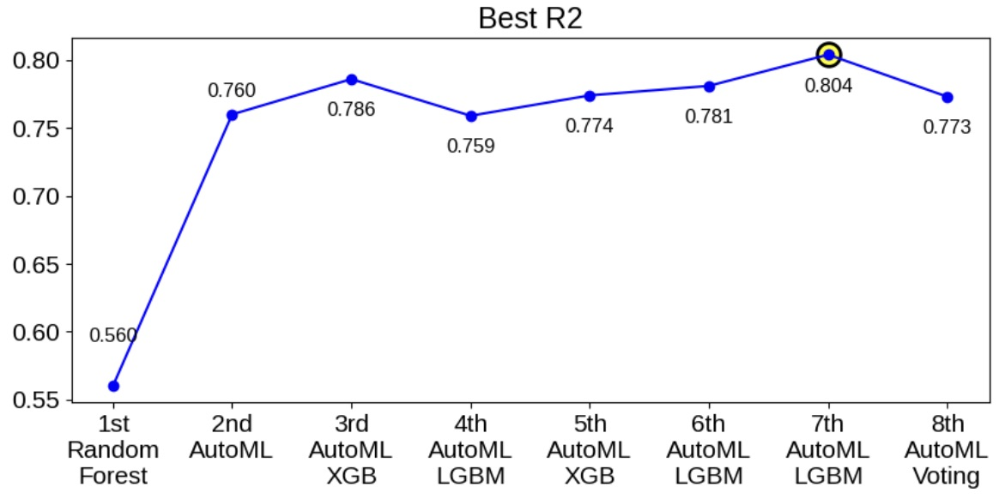

## 1. 프로젝트요약 

## 2. 프로젝트 배경 및 목표 
### 2-1. 배경
- `주택가격 예측 모델`과 관련된 기존 모델들은 `모델 집중형`, `상관관계 집중형`으로 나뉨
    - 모델 집중형
        - 모델 성능 우수  
        - 이미 입증된 변수 사용 -> 인사이트 한정적 
    - 상관관계 집중형
        - 흥미로운 상관관계 도출 가능
        - 독립변수 개수가 한정적 
### 2-2. 목표
- 40개 이상의 독립변수
- 0.8이상의 R2값

## 3. 프로젝트 단계별 내용
### 3-1. 데이터 수집
- 수집처 
    - 공공기관 
    - 기관 및 연구소 repository
    - 데이터 대회 플랫폼
    - 데이터 마켓
    - 사기업 

- 데이터 구분
    - 요인별 구분
        - 일반요인(국가/시단위 적용)
        - 지역요인(구단위 적용)
        - 개별요인(매물단위 적용)
    - 특성별 구분
        - 물리적 특성
        - 경제적 특성
        - 사회행정적 특성
        - 보건적 특성
        - 입지적 특성
-  ***49개의 독립변수 수집 완료***

### 3-2. 데이터 전처리 
- 종속변수: 2022년 서울시 아파트 구별 매매가 
- 독립변수: 지역구, 연도, 월, 일 기준 병합 및 정렬
- Scaling: Min-Max Scaler
- Encoding: Label Encoder 

### 3-3. 모델링

